# 📈 StockTradePro - Frontend

<div align="center">


**A Modern, Feature-Rich Stock Trading Platform Built with React**

[](https://reactjs.org/)
[](https://redux-toolkit.js.org/)
[](https://vitejs.dev/)
[](https://tailwindcss.com/)
[](LICENSE)

[🚀 Live Demo](#) • [📖 Documentation](#features) • [🐛 Report Bug](#) • [✨ Request Feature](#)

</div>

---

## 🌟 Overview

StockTradePro is a comprehensive stock trading platform that provides real-time market data, portfolio management, and seamless trading capabilities. Built with modern web technologies, it offers an intuitive user experience with both light and dark themes.

### ✨ Key Highlights

- 📊 **Real-time Stock Data** - Live market prices and changes
- 💼 **Portfolio Management** - Track your investments with P&L analysis
- 📱 **Responsive Design** - Works flawlessly on all devices
- 🌙 **Dark Mode** - Easy on the eyes during late-night trading
- ⚡ **Fast & Smooth** - Built with Vite for lightning-fast performance
- 🔐 **Secure** - JWT-based authentication with encrypted storage

---

## 🎯 Features

### 🔐 **Authentication & User Management**
- ✅ Secure user registration with email, mobile, and PAN validation
- ✅ JWT-based authentication with auto token refresh
- ✅ User profile management (update name, mobile)
- ✅ Protected routes with authentication guards
- ✅ Session persistence across browser refreshes

### 📊 **Stock Market**
- 🔍 **Smart Search** - Find stocks by symbol or company name
- 🏷️ **Sector Filtering** - Filter stocks by industry sector
- 📈 **Sortable Columns** - Click headers to sort by price, change%, market cap
- ♾️ **Infinite Scroll** - Seamless browsing with lazy loading
- 🖼️ **Stock Logos** - Visual identification with company logos
- 📉 **Real-time Updates** - Live price changes and market data

### 💼 **Portfolio Management**
- 📊 **Visual Analytics** - Interactive pie chart showing asset distribution
- 💰 **P&L Tracking** - Real-time profit/loss calculations
- 📈 **Realized vs Unrealized** - Separate tracking for sold vs held stocks
- 🎯 **Performance Metrics** - Returns percentage for each holding
- 📱 **Responsive Tables** - Beautiful display of all holdings

### 💸 **Trading**
- ⚡ **Quick Buy/Sell** - Execute trades with just a few clicks
- 📝 **Transaction Notes** - Add personal notes to each trade
- 💵 **Balance Check** - Real-time validation of available funds
- 🔄 **Auto-refresh** - Dashboard updates automatically after trades
- ✅ **Quantity Validation** - Can't sell more than you own

### 📋 **Transaction History**
- 🗓️ **Date Range Filters** - Filter by custom date ranges
- 🔍 **Type Filters** - View BUY, SELL, or ALL transactions
- 📄 **Export Options** - Download as PDF or CSV
- ♾️ **Pagination** - Navigate through transaction history
- 📊 **Detailed View** - See notes, prices, quantities for each trade

### ⭐ **Watchlist**
- ⭐ **Quick Add** - Add stocks to watchlist from stock detail page
- 📊 **Price Tracking** - Monitor price changes for watched stocks
- 🗑️ **Easy Remove** - One-click removal from watchlist
- 🔔 **Visual Updates** - Color-coded price changes

### 🎨 **User Experience**
- 🌙 **Dark/Light Mode** - Toggle theme based on preference
- 🎉 **Toast Notifications** - Beautiful success/error messages
- ⏳ **Loading Skeletons** - Smooth loading states (no boring spinners!)
- 🎯 **Intuitive UI** - Clean, modern interface
- 📱 **Mobile Responsive** - Optimized for all screen sizes
- ⚡ **Fast Performance** - Optimized with code splitting and lazy loading

---

# 🌐🚀 Live Deployment
- 🔗 Frontend Deployment
👉**[https://stocktradepro-frontend.vercel.app/](https://stocktradepro-frontend.vercel.app/)**

---

## 🛠️ Tech Stack

### **Core Technologies**
| Technology | Purpose | Version |
|------------|---------|---------|
| ⚛️ **React** | UI Framework | 18.3.1 |
| 🔄 **Redux Toolkit** | State Management | 2.3.0 |
| ⚡ **Vite** | Build Tool | 5.4.11 |
| 🎨 **TailwindCSS** | Styling | 3.4.15 |
| 🛣️ **React Router** | Routing | 7.1.1 |

### **Key Libraries**
| Library | Purpose | Version |
|---------|---------|---------|
| 📋 **React Hook Form** | Form Handling | 7.54.2 |
| ✅ **Yup** | Form Validation | 1.5.0 |
| 🌐 **Axios** | HTTP Client | 1.7.9 |
| 🎉 **React Hot Toast** | Notifications | 2.4.1 |
| 📊 **Recharts** | Data Visualization | 2.15.0 |
| ♾️ **React Infinite Scroll** | Infinite Scrolling | 6.1.0 |
| 🎨 **Clsx** | Conditional Classes | 2.1.1 |
| 🎭 **React Icons** | Icon Library | 5.4.0 |

---

## 📁 Project Structure

```
frontend/
│
├── 📂 public/                  # Static assets
│   └── vite.svg
│
├── 📂 src/
│   ├── 📂 app/                 # Redux store & context
│   │   ├── 📂 context/
│   │   │   └── ThemeContext.jsx
│   │   ├── hooks.js
│   │   ├── index.js
│   │   ├── rootReducer.js
│   │   └── store.js
│   │
│   ├── 📂 components/          # Reusable components
│   │   ├── 📂 common/
│   │   │   ├── SkeletonLoader.jsx
│   │   │   ├── ThemeToggle.jsx
│   │   │   └── ToastProvider.jsx
│   │   ├── 📂 layout/
│   │   │   ├── AppLayout.jsx
│   │   │   ├── Header.jsx
│   │   │   └── Sidebar.jsx
│   │   └── ProtectedRoute.jsx
│   │
│   ├── 📂 features/            # Redux slices (feature-based)
│   │   ├── 📂 auth/
│   │   │   ├── authSelectors.js
│   │   │   ├── authSlice.js
│   │   │   ├── authThunks.js
│   │   │   └── index.js
│   │   ├── 📂 dashboard/
│   │   ├── 📂 portfolio/
│   │   ├── 📂 stocks/
│   │   ├── 📂 transactions/
│   │   └── 📂 watchlist/
│   │
│   ├── 📂 pages/               # Page components
│   │   ├── About.jsx
│   │   ├── Dashboard.jsx
│   │   ├── Landing.jsx
│   │   ├── Login.jsx
│   │   ├── Portfolio.jsx
│   │   ├── Profile.jsx
│   │   ├── Register.jsx
│   │   ├── StockDetail.jsx
│   │   ├── StockMarket.jsx
│   │   ├── Transactions.jsx
│   │   ├── Watchlist.jsx
│   │   └── index.js
│   │
│   ├── 📂 routes/              # Route configuration
│   │   └── AppRoutes.jsx
│   │
│   ├── 📂 services/            # API services
│   │   └── axiosInstance.js
│   │
│   ├── 📂 utils/               # Utility functions
│   │   └── toast.js
│   │
│   ├── App.jsx                 # Root component
│   ├── main.jsx                # Entry point
│   └── index.css               # Global styles
│
├── .env.example                # Environment variables template
├── package.json
├── vite.config.js
└── tailwind.config.js
```

---

## 📸 Screenshots

- The following screenshots demonstrate the complete user and admin workflows of the Shopnetic E-commerce application, covering authentication, product browsing, checkout, order management, invoice downloads, and admin analytics.

## 👤 User Flow Screenshots

### 🏠 Home (Landing) Page
- The landing page introduces StockTradePro with navigation, market overview, trending stocks, and quick access to authentication pages.
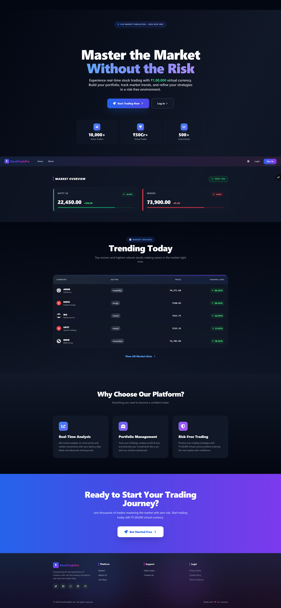

### 📝 Register Page
- User registration page with PAN, email, mobile number, and password validation to ensure secure account creation.
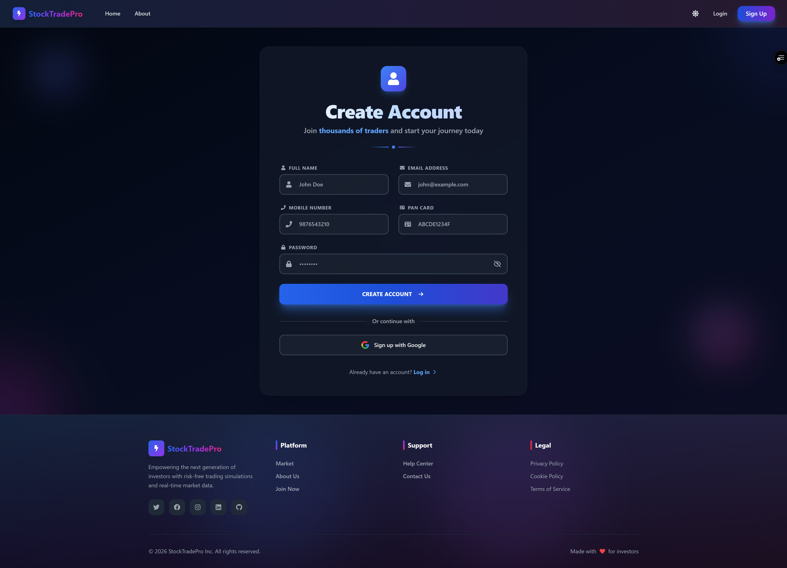

### 🔐 Login Page
- Login interface allowing registered users to securely authenticate and access their trading dashboard.
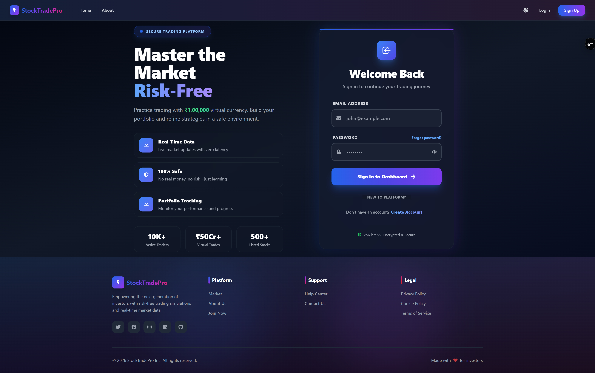

### 📊 User Dashboard
- Dashboard displaying user portfolio summary, available balance, market overview, and watchlist for quick monitoring.
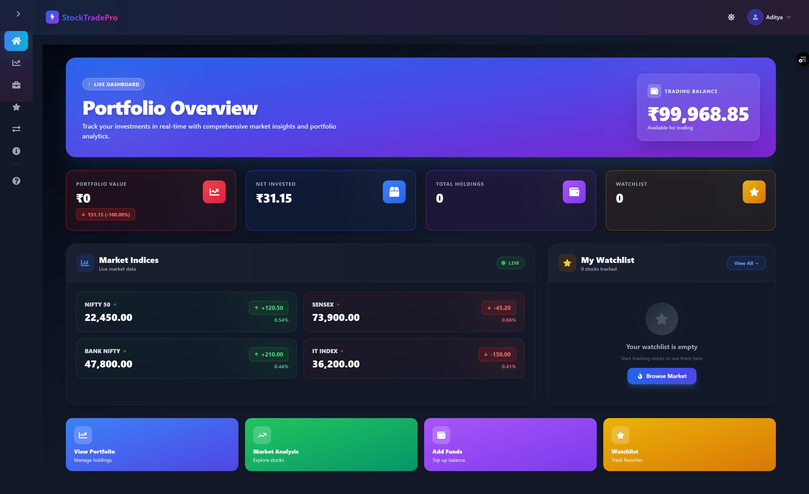

### 📈 Stock Market Page
- Stock market listing page showing all available stocks with search, sector filtering, and pagination.
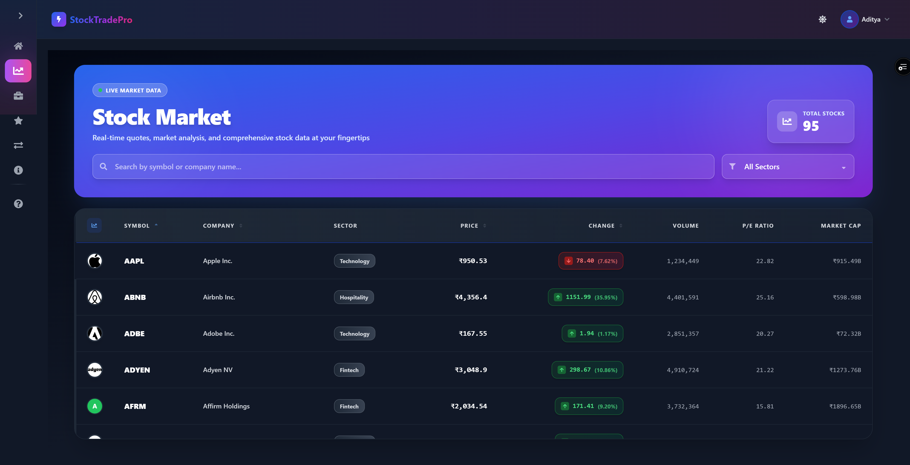

### 📉 Stock Detail Page
- Detailed stock view with price chart, company information, buy/sell actions, and add-to-watchlist functionality.
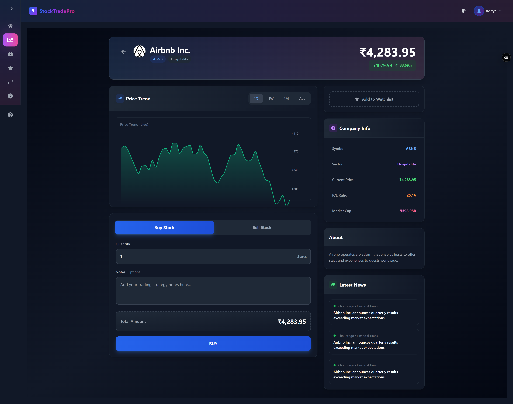

### 💼 Transaction History Page
Transaction history displaying all buy and sell records with detailed trade information.
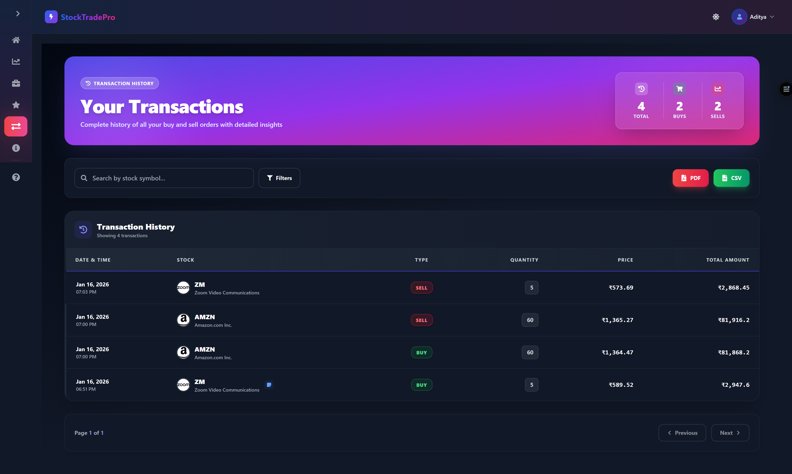

### 💰 Portfolio Page
- Portfolio page showing current holdings, invested value, and real-time simulated market valuation.
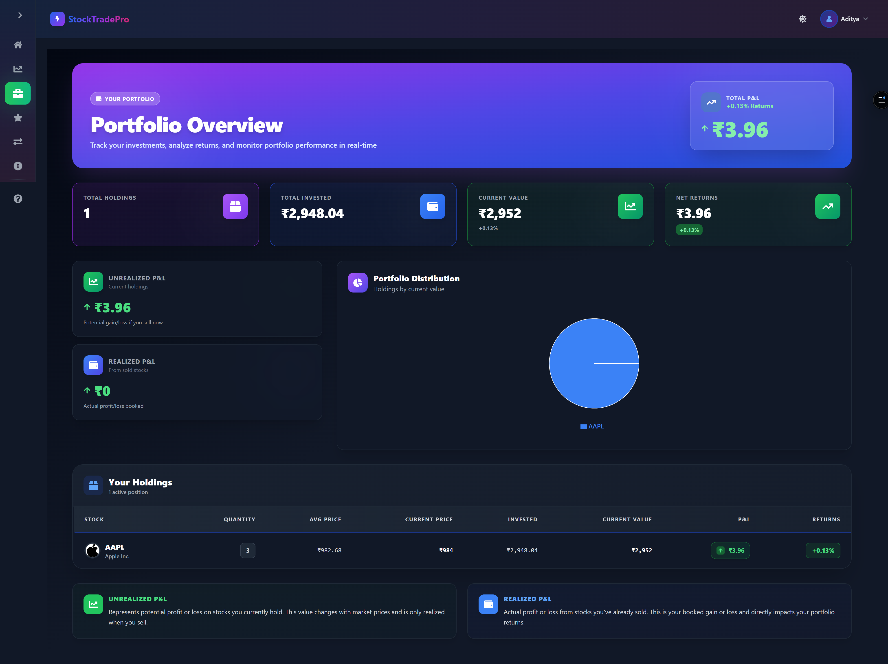

### ℹ️ About Page
- About page describing the StockTradePro platform, its purpose, and overall vision.
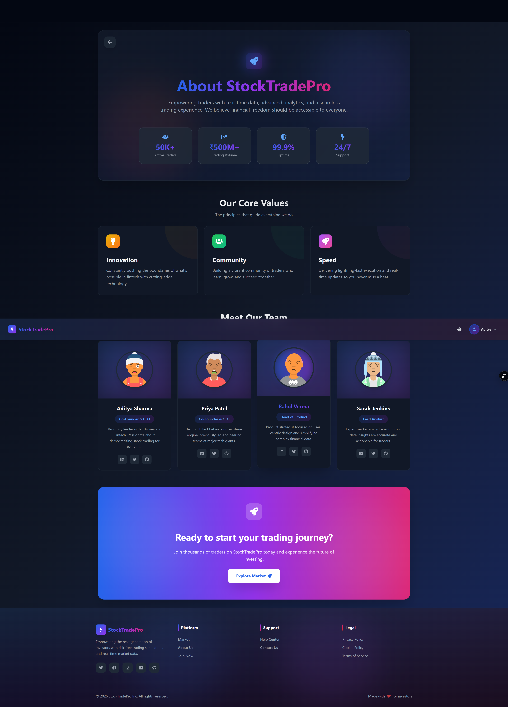

### ❓ FAQ Page
- Frequently Asked Questions section implemented using an accordion layout for improved user experience.
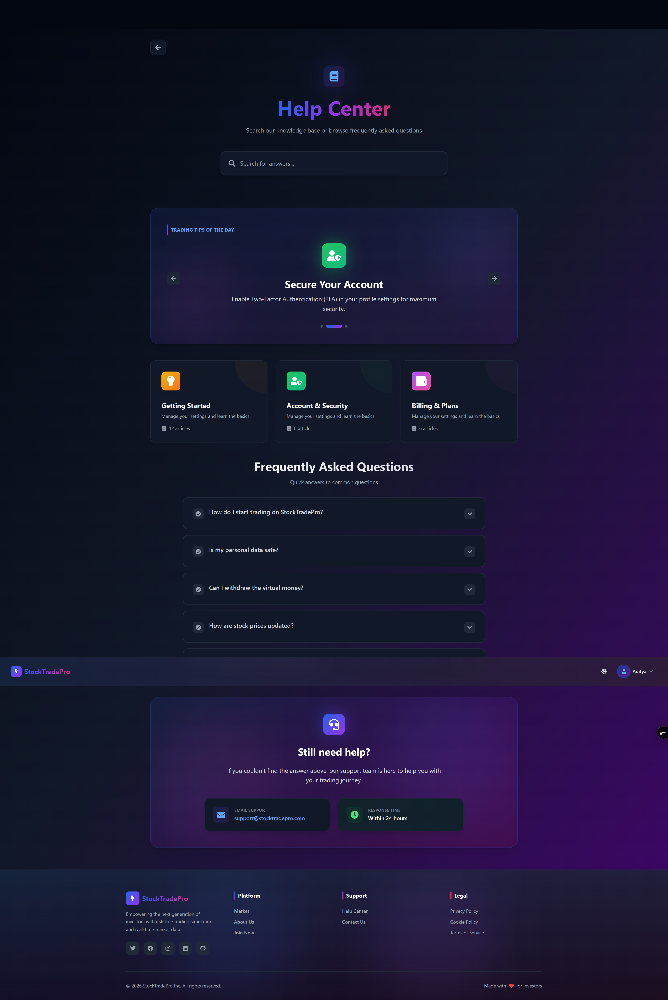

### 🧾 Export Transactions (PDF)
- Exported transaction history in PDF format, allowing users to download and retain their trade records.
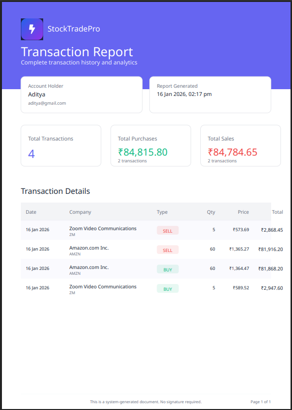

---

### ✨ Ongoing Enhancement
- Login and Signup using Google OAuth 2.0
- Forgot Password Recovery Feature
- Wallet Topup Feature using Stripe Payment APIs

## 🚀 Getting Started

### **Prerequisites**

Before you begin, ensure you have the following installed:

- 📦 **Node.js** (v18 or higher) - [Download here](https://nodejs.org/)
- 📦 **npm** (v9 or higher) - Comes with Node.js
- 🔧 **Git** - [Download here](https://git-scm.com/)

### **Installation**

1️⃣ **Clone the repository**

```bash
git clone https://github.com/yourusername/stocktradepro-frontend.git
cd stocktradepro-frontend
```

2️⃣ **Install dependencies**

```bash
npm install
```

3️⃣ **Set up environment variables**

Create a `.env` file in the root directory:

```env
VITE_API_BASE_URL=http://localhost:10000/api/v1
```

4️⃣ **Start the development server**

```bash
npm run dev
```

🎉 **That's it!** Open [http://localhost:5173](http://localhost:5173) in your browser.

---

## 📜 Available Scripts

| Command | Description |
|---------|-------------|
| `npm run dev` | 🚀 Start development server |
| `npm run build` | 🏗️ Build for production |
| `npm run preview` | 👀 Preview production build |
| `npm run lint` | 🔍 Run ESLint |

---

## 🔧 Configuration

### **Environment Variables**

| Variable | Description | Default |
|----------|-------------|---------|
| `VITE_API_BASE_URL` | Backend API URL | `http://localhost:10000/api/v1` |

### **Tailwind Configuration**

The project uses a custom Tailwind configuration with:
- 🎨 Custom color palette
- 🌙 Dark mode support (class-based)
- 📱 Custom breakpoints
- 🎯 Custom animations

---

## 🎨 Design System

### **Color Palette**

```css
/* Primary Colors */
--blue-600: #2563EB    /* Primary actions */
--green-600: #16A34A   /* Success states */
--red-600: #DC2626     /* Error states */
--yellow-600: #CA8A04  /* Warning states */

/* Neutrals */
--gray-50: #F9FAFB     /* Light backgrounds */
--gray-900: #111827    /* Dark backgrounds */
```

### **Typography**

- **Font Family**: System font stack (native, fast-loading)
- **Headings**: Semi-bold, responsive sizing
- **Body**: Regular weight, 14-16px

### **Components**

- **Buttons**: Rounded, shadow on hover, active states
- **Cards**: Subtle borders, hover effects
- **Tables**: Zebra striping, hover rows
- **Inputs**: Focus rings, validation states

---

## 🔐 Authentication Flow

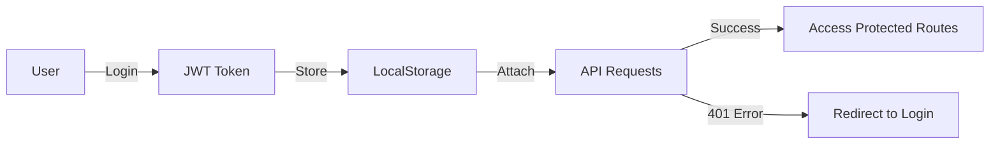

---

## 📊 State Management

### **Redux Store Structure**

```javascript
{
  auth: {
    user: Object,
    token: String,
    isAuthenticated: Boolean,
    loading: Boolean,
    error: String
  },
  dashboard: {
    balance: Number,
    netInvestedAmount: Number,
    holdingsCount: Number,
    watchlistCount: Number
  },
  stocks: {
    list: Array,
    selectedStock: Object,
    page: Number,
    totalPages: Number
  },
  portfolio: {
    holdings: Array,
    summary: Object
  },
  transactions: {
    list: Array,
    page: Number,
    totalPages: Number
  },
  watchlist: {
    items: Array
  }
}
```

---

## 🌐 API Integration

### **Axios Instance Configuration**

```javascript
// Base URL
baseURL: process.env.VITE_API_BASE_URL

// Request Interceptor
- Adds JWT token to headers
- Handles CORS

// Response Interceptor
- Auto-logout on 401
- Global error handling
- Rate limit detection
```

### **Available Endpoints**

| Method | Endpoint | Description |
|--------|----------|-------------|
| `POST` | `/auth/login` | User login |
| `POST` | `/auth/register` | User registration |
| `GET` | `/auth/profile` | Get user profile |
| `PUT` | `/auth/profile` | Update profile |
| `GET` | `/stocks` | List all stocks |
| `GET` | `/stocks/:id` | Get stock details |
| `GET` | `/portfolio` | Get portfolio |
| `GET` | `/dashboard/summary` | Dashboard data |
| `GET` | `/transactions` | Transaction history |
| `POST` | `/transactions/buy` | Buy stock |
| `POST` | `/transactions/sell` | Sell stock |
| `GET` | `/transactions/export/pdf` | Export PDF |
| `GET` | `/transactions/export/csv` | Export CSV |
| `GET` | `/watchlist` | Get watchlist |
| `POST` | `/watchlist` | Add to watchlist |
| `DELETE` | `/watchlist/:id` | Remove from watchlist |

---

## 🎯 Key Features Implementation

### **1. Infinite Scroll in Stock Market**

```javascript
import InfiniteScroll from 'react-infinite-scroll-component';

<InfiniteScroll
  dataLength={stocks.length}
  next={loadMoreStocks}
  hasMore={hasMore}
  loader={<Loader />}
>
  {/* Stock list */}
</InfiniteScroll>
```

### **2. Sortable Table Headers**

```javascript
const handleSort = (field) => {
  if (sortBy === field) {
    setOrder(order === "asc" ? "desc" : "asc");
  } else {
    setSortBy(field);
    setOrder("desc");
  }
};
```

### **3. Toast Notifications**

```javascript
import toast from '@/utils/toast';

// Success
toast.success("Stock purchased successfully!");

// Error
toast.error("Insufficient balance");

// Loading
const toastId = toast.loading("Processing...");
toast.dismiss(toastId);
```

### **4. Auto-refresh After Trade**

```javascript
const handleTrade = async () => {
  await dispatch(buyStock(data));
  
  // Auto-refresh
  await Promise.all([
    dispatch(fetchDashboardSummary()),
    dispatch(fetchPortfolio())
  ]);
};
```

---

## 📱 Responsive Design

### **Breakpoints**

| Breakpoint | Width | Target |
|------------|-------|--------|
| `sm` | 640px | Tablets |
| `md` | 768px | Small laptops |
| `lg` | 1024px | Desktops |
| `xl` | 1280px | Large screens |
| `2xl` | 1536px | Ultra-wide |

### **Mobile-First Approach**

- All components designed mobile-first
- Touch-friendly tap targets (48px minimum)
- Collapsible sidebar on mobile
- Responsive tables with horizontal scroll

---

## 🧪 Frontend Testing

To ensure a reliable, bug-free, and maintainable frontend, StockTradePro uses modern testing tools focused on component behavior and user interactions.

- ⚙️ Testing Stack
- ⚡ Vitest – Fast, Vite-native test runner
- 🧩 React Testing Library – Component testing from the user’s perspective
- 🧠 jsdom – Browser-like environment for DOM testing

```bash
# Run unit tests (if configured)
npm test

# Run E2E tests (if configured)
npm run test:e2e
```

---

## 🚀 Deployment

### **Build for Production**

```bash
npm run build
```

This creates an optimized production build in the `dist/` folder.

### **Deployment Options**

#### **Vercel** (Recommended)

```bash
npm install -g vercel
vercel --prod
```

#### **Netlify**

```bash
npm install -g netlify-cli
netlify deploy --prod
```

#### **Docker**

```dockerfile
FROM node:18-alpine
WORKDIR /app
COPY package*.json ./
RUN npm ci
COPY . .
RUN npm run build
EXPOSE 5173
CMD ["npm", "run", "preview"]
```

---

## 🔍 Browser Support

| Browser | Version |
|---------|---------|
| Chrome | ✅ Latest 2 versions |
| Firefox | ✅ Latest 2 versions |
| Safari | ✅ Latest 2 versions |
| Edge | ✅ Latest 2 versions |

---

## 🤝 Contributing

We welcome contributions! Please follow these steps:

1. 🍴 Fork the repository
2. 🌿 Create a feature branch (`git checkout -b feature/AmazingFeature`)
3. 💾 Commit your changes (`git commit -m 'Add AmazingFeature'`)
4. 📤 Push to the branch (`git push origin feature/AmazingFeature`)
5. 🔁 Open a Pull Request

### **Code Style**

- Use ESLint configuration
- Follow React best practices
- Write meaningful commit messages
- Add comments for complex logic

---

## 📝 Changelog

### **v1.0.0** (Current)

#### ✨ Features
- Complete authentication system
- Real-time stock market data
- Portfolio management with P&L
- Transaction history with filters
- Watchlist functionality
- Dark/Light theme toggle
- Profile management

#### 🐛 Bug Fixes
- Fixed auto-refresh after trades
- Improved loading states
- Enhanced error handling

---

## 🆘 Troubleshooting

### **Common Issues**

**Problem:** `npm install` fails

**Solution:**
```bash
rm -rf node_modules package-lock.json
npm install
```

**Problem:** Development server won't start

**Solution:**
```bash
# Check if port 5173 is in use
lsof -ti:5173 | xargs kill -9
npm run dev
```

**Problem:** API calls failing

**Solution:**
- Check `.env` file exists
- Verify `VITE_API_BASE_URL` is correct
- Ensure backend is running

---

## 📚 Resources

- 📖 [React Documentation](https://react.dev/)
- 🔄 [Redux Toolkit Docs](https://redux-toolkit.js.org/)
- ⚡ [Vite Guide](https://vitejs.dev/guide/)
- 🎨 [Tailwind CSS Docs](https://tailwindcss.com/docs)
- 🛣️ [React Router Docs](https://reactrouter.com/)

---

### Known Browser Warning

The application loads stock logos as external SVGs from the Simple Icons CDN.
Modern browsers may log CORB (Cross-Origin Read Blocking) warnings for these SVGs.
This is expected browser behavior and does not affect functionality or security.

---

## 📄 License

This project is licensed under the MIT License - see the [LICENSE](LICENSE) file for details.

---

## 👥 Team

**Built with ❤️ by the StockTradePro Team**

- 🎨 **Design**: Modern UI/UX principles
- 💻 **Development**: React + Redux best practices
- 🔐 **Security**: JWT authentication, secure API calls
- 🚀 **Performance**: Optimized with code splitting & lazy loading

---

## 🌟 Show Your Support

If you found this project helpful, please give it a ⭐ on GitHub!

---

## 📞 Contact

- 📧 Email: support@stocktradepro.com
- 🐦 Twitter: [@StockTradePro](https://twitter.com/stocktradepro)
- 💬 Discord: [Join our community](https://discord.gg/stocktradepro)

---

<div align="center">

**Made with ❤️ using Vite, React, Redux, and Tailwind CSS**

[⬆ Back to Top](#-stocktradepro---frontend)

</div>